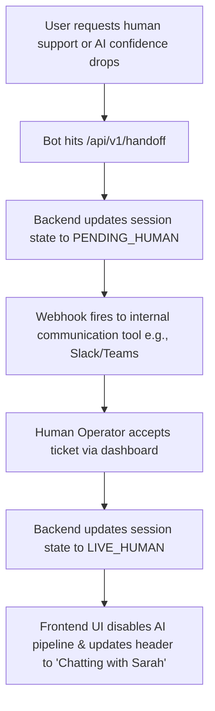

# Functional Specification: Embeddable Agentic Chat Bot

## 1. Objective & Scope
Build an embeddable asynchronous chat widget that integrates with any existing HTML static website via a single script tag. The widget acts as an AI conversational agent but can transfer seamlessly to a human support agent upon explicit escalation triggers.

## 2. User Experience (UX) Journeys

### 2.1 AI Agent Conversation Flow
1. **Entry**: Non-floating action buttons can appear at predetermined places in existing host web pages.
2. **Activation**: Clicking the action button opens a clean, integrated chat window panel without overlaying or disrupting page flow.
3. **Context**: The invocation of the chat panel can include structured pre-defined context metadata (e.g., page URL or other elements) to be sent to the backend for better managing responses and human escalation.
3. **Session Recovery**: The application can leverage local token storage. If a valid session exists, it populates past history up to 20 messages.
4. **Interaction**: User types a query. A visual typing indicator appears while the AI agent stream-renders the response markdown.

### 2.2 Human Handoff Flow

## 3. Accessibility  Constraints
The AI agent must structurally guarantee compliant accessibility out-of-the-box.
* **Keyboard Navigation**: The entire widget must be navigable using standard tabular focus (`Tab`, `Shift+Tab`) and integrate with the existing host page components seamlessly.
* **Focus Management**: Opening the chat panel shifts focus directly to the text input box; closing it returns focus immediately to the host page.
* **Screen Readers**:
  * Refer to the ONS Design System accessibility guidelines for ARIA roles and properties.
  * The main panel must use `role="complementary"`.
  * Every input element must contain an explicit, non-visual label using `aria-label`.
* **Contrast Compliance**: Text-to-background contrast ratios must conform strictly to WCAG 2.1 AA benchmarks (minimum 4.5:1).

## 4. Acceptance Criteria
* [ ] Widget loads asynchronously without delaying the host static site's `DOMContentLoaded` metric.
* [ ] Screen readers cleanly verbalise new message updates dynamically without losing keyboard input focus.
* [ ] The chatbot can process a user handoff request and visually alter the UI within 1.5 seconds.
